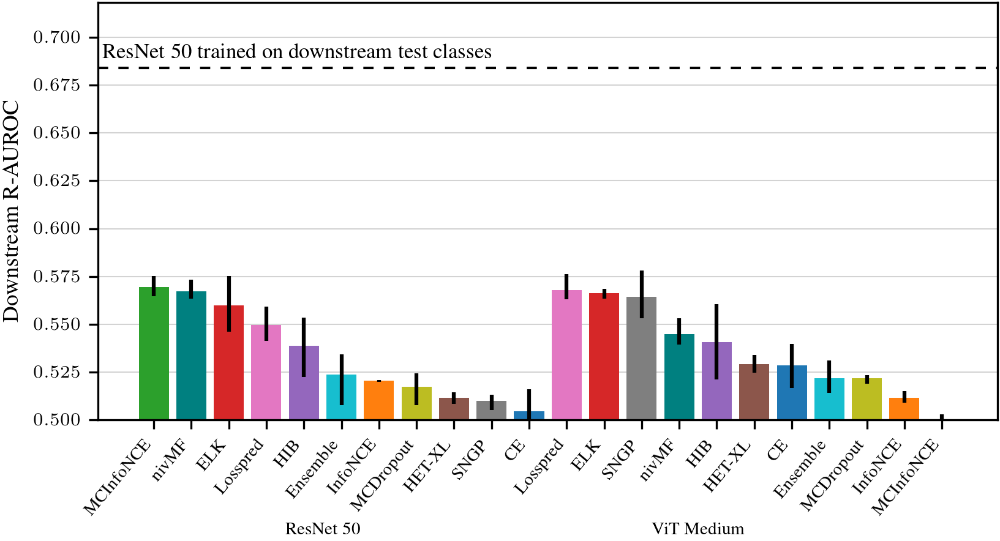

# URL: A Representation Learning Benchmark for <br> Transferable Uncertainty Estimates

Michael Kirchhof, Bálint Mucsányi, Seong Joon Oh, Enkelejda Kasneci



_Representation learning has driven the field to develop pretrained models that generalize and transfer to new datasets. With the rising demand of reliable machine learning and uncertainty quantification, we seek pretrained models that output both an embedding and an uncertainty estimate, even on unseen datasets. To guide the development of such models, we propose the uncertainty-aware representation learning (URL) benchmark. It measures whether the uncertainty predicted by a model reliably reveals the uncertainty of its embedding. URL takes only four lines of code to implement but still has an information-theoretical backbone and correlates with human-perceived uncertainties. We apply URL to study ten large-scale uncertainty quantifiers that were pretrained on ImageNet and transfered to eight downstream datasets. We find that transferable uncertainty quantification is an unsolved open problem, but that it appears to be not at stakes with classical representation learning._

**Link**: [arxiv.org/abs/2307.03810](https://www.arxiv.org/abs/2307.03810)

---

## Installation

**TL;DR:** Create a conda environment with ```conda env create -f requirements.yml```, then [download the datasets](#datasets).

### Conda environment

Long answer: First, install Python 3.8.8 and PyTorch 1.10 with a CUDA backend that suits your GPU (in this case, CUDA 11.1)

```
pip install python=3.8.8
conda install pytorch==1.13.0 torchvision==0.14.0 torchaudio==0.13.0 pytorch-cuda=11.7 -c pytorch -c nvidia
```

Then, install the dependencies:

```
pip install matplotlib pyyaml huggingface_hub safetensors>=0.2 scipy==1.7.1 argparse==1.4.0 tueplots==0.0.5 wandb==0.13.5 torchmetrics==0.11.3 scikit-learn==0.24.1 pandas==1.2.4
conda install -c pytorch faiss-gpu
```

### Datasets

Now, download all datasets. The scripts search for them by default under ```./data```. You can adjust this via the arguments ```--data-dir``` for the upstream (ImageNet) dataset, ```--data-dir-downstream``` for the zero-shot downstream and further downstream datasets, and ```--real-labels``` and ```--soft-labels``` for the auxiliary ImageNet-RealH files. If your downstream datasets are spread over multiple directories, consider providing one folder that gives symlinks to them.

Upstream dataset: [ImageNet-1k](https://www.image-net.org/download.php)

ImageNet-RealH files: [raters.npz](https://github.com/google-research/reassessed-imagenet/blob/master/raters.npz) and [real.json](https://github.com/google-research/reassessed-imagenet/blob/master/real.json)

Downstream datasets: [CUB200-211](https://www.dropbox.com/s/tjhf7fbxw5f9u0q/cub200.tar?dl=0), [CARS196](https://www.dropbox.com/s/zi2o92hzqekbmef/cars196.tar?dl=0), [Stanford Online Products](https://www.dropbox.com/s/fu8dgxulf10hns9/online_products.tar?dl=0)

Further downstream datasets: [CIFAR-10H, Treeversity#1, Turkey, Pig, Benthic](https://doi.org/10.5281/zenodo.7152309)

Please verify that your folder structure for the downstream datasets looks like this (note the folder names for each dataset):

```
cub200
└───images
|    └───BMW 3 Series Wagon 2012
|           │   00039.jpg
|           │   ...
|    ...
cars196
└───images
|    └───001.Black_footed_Albatross
|           │   Black_Footed_Albatross_0001_796111.jpg
|           │   ...
|    ...
online_products
└───images
|    └───bicycle_final
|           │   111085122871_0.jpg
|    ...
|
└───Info_Files
|    │   bicycle.txt
|    │   ...
```

The further downstream datasets should look like this directly after unzipping

```
CIFAR10H/Treeversity#1/Turkey/Pig/Benthic
└───fold1
|    │   182586_00.png
|    ...
└───annotations.json
```

---

## Training and Benchmarking your own Method

Training happens in ```train.py```. This is adapted from the ```timm``` library, including all its models, to which we added various uncertainty output methods, so that all models have outputs of the form ```class_logits, uncertainties, embeddings = model(input)```. The best starting point to implement your own ideas would be to adapt the uncertainty output methods in ```./timm/models/layers/_uncertainizer.py```, implement losses in ```./timm/loss```, or enhance model architectures in ```./timm/models```.

The URL benchmark is evaluated in ```validate.py```, which is called during training, but can also be used stand-alone if you prefer to train with your own code. An exemplary call would be

```
train.py --model=resnet50 --loss=elk --inv_temp=28  --unc-module=pred-net --unc_width=1024 --ssl=False 
--warmup-lr=0.0001 --lr-base=0.001 --sched=cosine --batch-size=128 --accumulation_steps=16 --epochs=32 
--seed=1 --eval-metric avg_downstream_auroc_correct --log-wandb=True 
--data-dir=./data/ImageNet2012 --data-dir-downstream=./data --soft-labels=./data/raters.npz --real-labels=./data/real.json
```

The most important parameters are:
* ```--model``` Which backbone to use. In our paper, we use ```resnet50``` and ```vit_medium_patch16_gap_256```.
* ```--loss``` Which loss to use. Note that some approaches, like MCDropout, use a ```cross-entropy``` loss, but specify other parameters to make them into their own loss. Please refer to the example codes below.
* ```--inv_temp``` The hyperparameter constant the distances in the softmax exponentials are multiplied by. This can also be understood as the inverse of the temperature. Some approaches require further hyperparameters. Please refer to the example codes below.
* ```--unc-module``` How to calculate the uncertainty attached to each embedding. Popular choices are an explicit ```pred-net``` module attached to the model or the ```class-entropy``` of the predicted upstream class label distribution. These uncertainty modules are implemented as wrappers around the models, so that any combination of model backbone and uncertainty method should work.
* ```--unc_width``` If ```--unc-module=pred-net```, this gives the width of the 3-layer MLP to estimate uncertainties.
* ```--ssl``` Set to ```False``` if you want to learn with supervised labels and to ```True``` if you want to learn from self-supervised contrastive pairs. Note that these result in different data formats, such that not all losses are compatible with all settings. Please refer to the example codes below.
* ```--warmup-lr``` The fixed learning rate to use in the first epoch. Usually lower than the learning rate in later epochs.
* ```--lr-base``` The learning rate in reference to a batchsize of 256. This will be increased/decreased automatically if you use a smaller or bigger total batchsize. The current learning rate will be printed in the log.
* ```--sched``` Which learning rate scheduler to use. In the paper we use ```cosine``` annealing, but you may want to try out ```step```.
* ```--batch-size``` How many samples to process at the same time.
* ```--accumulation_steps``` How many batches to calculate before making one optimizer step. The accumulation steps times the batch size gives the final, effective batchsize. Loss scalers adjust to this automatically.
* ```--epochs``` Number of epochs to train for on the upstream dataset. Since we automatically start from pretrained checkpoints, this is set to ```32``` by default.
* ```--seed``` For final results, we replicate each experiment on the seeds ```1, 2, 3``
* ```--eval-metric``` Which metric to select the best epoch checkpoint by. We use ```avg_downstream_auroc_correct``` for the R-AUROC averaged across all downstream validation sets. These options here are the internal keys of the results dictionaries, as further detailed below. Keep in mind that the an ```eval_``` is prepended to the metric name internally, as we only allow to use metrics on the valiation splits to be used as ```eval-metric```.
* ```--log-wandb``` We recommend to set this to ```True``` to log your results in W&B. Don't forget to login with your API key.
* ```--data-dir``` Folder where ImageNet, or in general your upstream dataset, is stored.
* ```--data-dir-downstream``` Folder where **all** CUB200, CARS196, SOP, CIFAR10H, ..., are stored, or whichever downstream and further downstream datasets you use.
* ```--soft-labels``` and ```--real-labels``` Links to your ImageNet-Real H ```raters.npz``` and ```real.json``` files.

---

## Metrics

**TL;DR:** The R@1 and R-AUROC metrics reported in the paper are internally named ```best_test_avg_downstream_r1``` and ```best_test_avg_downstream_auroc_correct```. During hyperparameter tuning, please use them on their validation sets, i.e., ```best_eval_avg_downstream_r1``` and ```best_eval_avg_downstream_auroc_correct```.

**Long answer:** All metrics are named as follows:

```
<best/current epoch>_<dataset>_<metric>
```
, e.g., ```best_eval_avg_downstream_auroc_correct``` or ```eval_r1```.

* ```<best/current epoch>``` We prepend a ```best_``` if the metric is computed on the best so-far epoch. The best epoch is chosen via ```--eval-metric```, see above. If nothing is prepended, this is just the metric of the current epoch.
* ```<dataset>``` gives which dataset and eval/test split the metric is computed on. Options are 
  * ```eval``` The validation set given in ```--dataset_eval```, which is usually just the same as the upstream loader, i.e., ```torch/imagenet``` or ```soft/imagenet```.
  * ```eval_avg_downstream``` The average across the validation sets of all downstream loaders. They are defined via ```--dataset-downstream```.
  * ```test_avg_downstream``` The average across the test sets of all downstream loaders. They are defined via ```--dataset-downstream```.
  * ```furthertest_avg_downstream``` The average across the test sets of all "further" downstream loaders. They are defined via ```--further-dataset-downstream```. This is essentially just a second set of datasets to test on.
  * ```eval_repr/cub```, ```test_repr/cub```, ```furthertest_soft/benthic```, ..., The results on each individual dataset. This is done for all datasets in ```--dataset-downstream``` and ```--further-dataset-downstream```.
* ```<metric>``` Which metric we evaluate:
  * ```auroc_correct``` This is the R-AUROC from the paper main text. This is the main metric we focus on.
  * ```r1``` The R@1 from the paper main text. This is the second most important metric.
  * ```top1``` and ```top5``` The top-1 and top-5 accuracy of the classifier. This only makes sense on the upstream dataset (it is output aswell for downstream datasets just for modularity reasons).
  * ```croppedHasBiggerUnc``` How often a cropped version of an image has a higher uncertainty than the original version.
  * ```rcorr_crop_unc``` Rank correlation between how much we cropped an image and high uncertainty the model outputs. _Use with care!_ This is only implemented in reference to previous works. This metric only makes sense if all images show a single object, such that the amount of cropping has a roughly equal effect across all images. ```croppedHasBiggerUnc``` fixes this issue and should be preferred.
  * ```rcorr_entropy``` The rank correlation with the entropy of human soft label distributions. Only available for ```soft/...``` datasets.
  * ```min_unc```, ```avg_unc```, and ```max_unc``` The minimum, average, and maximum uncertainties across the dataset.

---

## Reproducing our Implemented Methods

Below are the calls to reproduce the URL benchmark results on all ten baseline approaches, both on ResNet and ViT backbones. They all use the best hyperparameters we found in our searches. All approaches in the paper were repeated on seeds 1, 2, and 3, which we do not show here for brevity.

### Cross Entropy

```
train.py --inv_temp=31.353232263344143 --loss=cross-entropy --lr-base=0.0027583475549166764 --model=resnet50 --unc-module=class-entropy --unc_start_value=0
```

```
train.py --img-size=256 --inv_temp=60.70635770117517 --loss=cross-entropy --lr-base=0.004954014361368407 --model=vit_medium_patch16_gap_256 --unc-module=class-entropy --unc_start_value=0
```

### InfoNCE

InfoNCE requires ```--ssl=True```, and a lower batchsize, since we forward two self-supervised crops per image.

```
train.py --accumulation_steps=21 --batch-size=96 --inv_temp=15.182859908025058 --loss=infonce --lr-base=0.0004452562693472003 --model=resnet50 --ssl=True --unc-module=embed-norm --unc_start_value=0
```

```
train.py --accumulation_steps=21 --batch-size=96 --img-size=256 --inv_temp=20.82011649785067 --loss=infonce --lr-base=0.006246538808281836 --model=vit_medium_patch16_gap_256 --ssl=True --unc-module=embed-norm --unc_start_value=0
```

### MCInfoNCE

MCInfoNCE requires ```--ssl=True```, and a lower batchsize, since we forward two self-supervised crops per image. The MC sampling MCInfoNCE adds over InfoNCE did not significantly impact runtime or memory usage.

```
train.py --accumulation_steps=21 --batch-size=96 --inv_temp=52.43117045513681 --loss=mcinfonce --lr-base=2.384205225724591e-05 --model=resnet50 --ssl=True --unc-module=pred-net --unc_start_value=0.001 --warmup-lr=3.487706876306753e-05
```

```
train.py --accumulation_steps=21 --batch-size=96 --img-size=256 --inv_temp=50.27568453131382 --loss=mcinfonce --lr-base=0.0031866603949435874 --model=vit_medium_patch16_gap_256 --ssl=True --unc-module=pred-net --unc_start_value=0.001
```

### Expected Likelihood Kernel (ELK)

```
train.py --inv_temp=27.685357549319253 --loss=elk --lr-base=0.008324452068209802 --model=resnet50 --unc-module=pred-net --unc_start_value=0
```

```
train.py --img-size=256 --inv_temp=56.77356863558765 --loss=elk --lr-base=0.009041687325778511 --model=vit_medium_patch16_gap_256 --unc-module=pred-net --unc_start_value=0
```

### Non-isotropic von Mises Fisher (nivMF)

```
train.py --inv_temp=10.896111351193488 --loss=nivmf --lr-base=0.00014942909398367403 --model=resnet50 --unc-module=pred-net --unc_start_value=0.001
```

```
train.py --img-size=256 --inv_temp=31.353232263344143 --loss=nivmf --lr-base=0.0027583475549166764 --model=vit_medium_patch16_gap_256 --unc-module=pred-net --unc_start_value=0.001
```

### Hedged Instance Embeddings (HIB)

HIB has an additional hyperparameter ```--hib_add_const``` to shift its sigmoid. HIB requires lower batchsizes to prevent running out of VRAM.

```
train.py --accumulation_steps=21 --batch-size=96 --hib_add_const=2.043464396656407 --inv_temp=26.850376086478832 --loss=hib --lr-base=5.606607236666466e-05 --model=resnet50 --unc-module=pred-net --unc_start_value=0 --warmup-lr=2.2864937540918197e-06
```

```
train.py --accumulation_steps=43 --batch-size=48 --hib_add_const=-5.360730528719454 --img-size=256 --inv_temp=13.955844954616405 --loss=hib --lr-base=0.0005920448270870512 --model=vit_medium_patch16_gap_256 --unc-module=pred-net --unc_start_value=0
```

### Heteroscedastic Classifiers (HET-XL)

HET-XL uses several hyperparameters, see the args in ```train.py```, most importantly the ```--rank_V``` of the covariance matrix and ```--c-mult```. HET-XL uses a standard cross-entropy loss, but a modified architecture, which you call via the ```--model``` argument. We've implemented this only for ResNet 50 and ViT Medium. It can also use either its covariance determinant or class entropy as ```--unc-module```. In our experiments, the latter outperformed the former.

```
train.py --c-mult=0.011311824684149863 --inv_temp=28.764754827923134 --loss=cross-entropy --lr-base=0.00030257136041070065 --model=resnet50hetxl --rank_V=1 --unc-module=class-entropy --unc_start_value=0
```

```
train.py --c-mult=0.011586882497402008 --img-size=256 --inv_temp=21.601079237861356 --loss=cross-entropy --lr-base=0.00012722151293115814 --model=vit_medium_patch16_gap_256hetxl --rank_V=1 --unc-module=hetxl-det --unc_start_value=0 
```

### Direct Risk Prediction (Riskpred)

Riskpred uses the ```--lambda-value``` hyperparameter to balance its cross entropy and uncertainty prediction loss.

```
train.py --inv_temp=27.538650119804444 --lambda-value=0.04137484664752506 --loss=riskpred --lr-base=0.00907673293373138 --model=resnet50 --unc-module=pred-net --unc_start_value=0 
```

```
train.py --img-size=256 --inv_temp=29.83516046330469 --lambda-value=0.011424752423322174 --loss=riskpred --lr-base=0.0026590263551453507 --model=vit_medium_patch16_gap_256 --unc-module=pred-net --unc_start_value=0.001 
```

### MCDropout

Specify the number of MC samples to take via ```--num-heads``` and the dropout rate via ```--drop```.

```
train.py --drop=0.08702220252645132 --inv_temp=29.31590841184109 --loss=cross-entropy --lr-base=0.00016199535513680024 --model=resnet50dropout --unc-module=jsd --unc_start_value=0 
```

```
train.py --drop=0.1334044009405148 --img-size=256 --inv_temp=57.13603169495254 --loss=cross-entropy --lr-base=0.0027583475549166764 --model=vit_medium_patch16_gap_256dropout --unc-module=class-entropy --unc_start_value=0 
```

### Ensemble

Specify the number heads via ```--num-heads```. This increases memory and computation usage.

```
train.py --inv_temp=29.89825063351814 --loss=cross-entropy --lr-base=0.004405890102835956 --model=resnet50 --num-heads=10 --unc-module=class-entropy --unc_start_value=0
```

```
train.py --img-size=256 --inv_temp=54.435826404570726 --loss=cross-entropy --lr-base=0.004944771531139904 --model=vit_medium_patch16_gap_256 --num-heads=10 --unc-module=class-entropy --unc_start_value=0 
```

### Spectral-normalized Neural Gaussian Processes (SNGP/GP)

SNGP has mutiple hyperparameters. Our implementation follows the defaults of the original paper. Most importantly, ```--use-spec-norm``` controls whether to use SNGP or drop the SN and only use GP. Like HET-XL, SNGP is called via a modified model architecture and otherwise uses a standard cross entropy loss.

```
train.py --gp-cov-discount-factor=-1 --gp-input-normalization=True --loss=cross-entropy --lr-base=0.003935036929170965 --model=resnet50sngp --spec-norm-bound=3.0034958778109893 --unc-module=class-entropy --unc_start_value=0 --use-spec-norm=True
```

```
train.py --gp-cov-discount-factor=0.999 --gp-input-normalization=True --img-size=256 --loss=cross-entropy --lr-base=0.0002973866135608272 --model=vit_medium_patch16_gap_256sngp --spec-norm-bound=2.0072013733952883 --unc-module=class-entropy --unc_start_value=0 --use-spec-norm=False
```

---

## Licenses

### Code

This repo bases largely on [timm](https://github.com/huggingface/pytorch-image-models) (Apache 2.0), with some dataloaders from [Revisiting Deep Metric Learning](https://github.com/Confusezius/Revisiting_Deep_Metric_Learning_PyTorch) (MIT Licence), and some methods from [Probabilistic Contrastive Learning](https://github.com/mkirchhof/Probabilistic_Contrastive_Learning) (MIT License). Several further methods are (re-)implemented by ourselves. Overall, this repo is thus under an Apache 2.0 License. That said, it is your responsibility to ensure you comply with licenses here and conditions of any dependent licenses. Where applicable, the sources/references for various components are linked in docstrings.

### Pretrained Weights
So far all of the pretrained weights available here are pretrained on ImageNet with a select few that have some additional pretraining (see extra note below). ImageNet was released for non-commercial research purposes only (https://image-net.org/download). It's not clear what the implications of that are for the use of pretrained weights from that dataset. Any models I have trained with ImageNet are done for research purposes and one should assume that the original dataset license applies to the weights. It's best to seek legal advice if you intend to use the pretrained weights in a commercial product.

#### Pretrained on more than ImageNet
Several weights included or references here were pretrained with proprietary datasets that I do not have access to. These include the Facebook WSL, SSL, SWSL ResNe(Xt) and the Google Noisy Student EfficientNet models. The Facebook models have an explicit non-commercial license (CC-BY-NC 4.0, https://github.com/facebookresearch/semi-supervised-ImageNet1K-models, https://github.com/facebookresearch/WSL-Images). The Google models do not appear to have any restriction beyond the Apache 2.0 license (and ImageNet concerns). In either case, you should contact Facebook or Google with any questions.

---

## Citing

```
@article{kirchhof2023url,
  title={URL: A Representation Learning Benchmark for Transferable Uncertainty Estimates},
  author={Michael Kirchhof and Bálint Mucsányi and Seong Joon Oh and Enkelejda Kasneci},
  journal={arXiv preprint arXiv:2307.03810},
  year={2023}
}
```

If you use the benchmark, please also cite the datasets.
